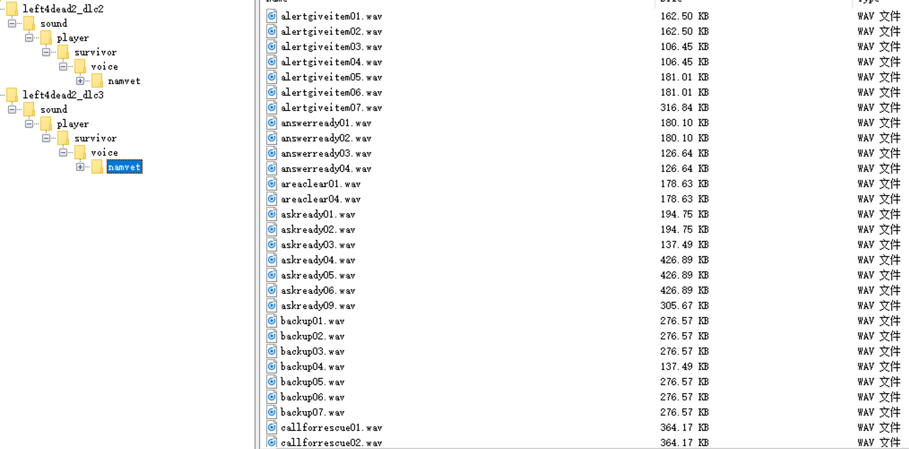

# L4D2-VoicePack-Installer
求生之路2语音包自动安装包，只需双击即可自动安装

## 使用方法
1. 下载.vpk文件的语音包放到addons目录下(steamapps/common/Left 4 Dead 2/left4dead2/addons)，或者从创意工坊下载(vpk文件会放到addons/workshop下)
2. 下载工具：https://github.com/Margular/L4D2-VoicePack-Installer/releases 然后直接双击即可自动安装，很简单吧？
3. 在求生之路控制台执行`snd_rebuildaudiocache`

## 支持的VPK文件格式
1. 目前只支持按原始方式打包的语音包，如下图所示(https://steamcommunity.com/sharedfiles/filedetails/?id=1808529794)：

## 后续工作
1. 支持解压7z,rar,zip等格式打包的语音包, 因为我发现有好多语音包里面是一个压缩包
2. 在安装语音包之前删除原有的语音文件，避免和系统语音共存
3. 自动调用求生之路执行`snd_rebuildaudiocache`

## 贡献
1. Fork这个项目然后提Pull request
2. 在Issues tab下提意见
