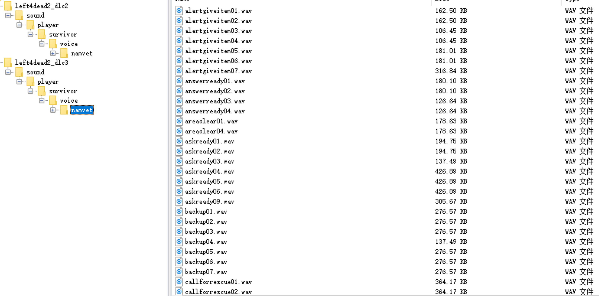

# L4D2-VoicePack-Installer
A smart voice pack installer for left for dead 2

## Usage
1. download voice pack .vpk and put it into l4d2 addons folder(steamapps/common/Left 4 Dead 2/left4dead2/addons)
2. simply download this tool from https://github.com/Margular/L4D2-VoicePack-Installer/releases, so easy right?

## Supported format of vpk
1. Now only support original pack of voice files, the structure of vpk like below

## To do
1. Support unpack 7z,rar,zip,etc. format file inside vpk, because I found many vpks packed as a 7z file
2. Delete the voice files in the target folder before installing the voice files, which will help those who do not want to have the system voice file at the same time.

## Contribute
1. You can fork this repository and pull request
2. Give some advice in the issues tab